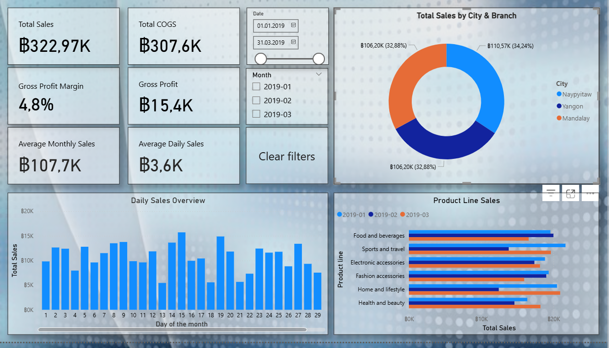

Projekt przedstawia interaktywny dashboard do analizy sprzedaży w trzech oddziałach supermarketu za pierwszy kwartał 2019 roku. Celem jest wizualizacja kluczowych wskaźników, identyfikacja trendów oraz wsparcie w podejmowaniu decyzji biznesowych.

O danych:

Dane pochodzą z platformy Kaggle: [Supermarket Sales Dataset](https://www.kaggle.com/datasets/faresashraf1001/supermarket-sales).
Zbiór danych zawiera informacje o sprzedaży w trzech oddziałach supermarketu w miastach Yangon, Mandalay oraz Naypyitaw za okres od stycznia do marca 2019 roku.

Narzędzia i etapy pracy:

Power Query w Power BI — do czyszczenia i przygotowania danych (usuwanie duplikatów, formatowanie dat, korekta typów danych) Power BI — do tworzenia interaktywnego kokpitu i wizualizacji

Dashboard zawiera:

Kluczowe wskaźniki efektywności (KPI) — całkowita sprzedaż, zysk brutto, średnia sprzedaż 
Średnia sprzedaż w przeliczeniu na miesiąc i dzień 
Filtry według daty i miesiąca do dynamicznej regulacji wyświetlanych danych 
Wizualizacja sprzedaży według miast i oddziałów — diagram kołowy Przegląd dziennej sprzedaży (wykres słupkowy) 
Porównanie sprzedaży według kategorii produktów w podziale na miesiące (wykresy poziome)

Wnioski i obserwacje:

W analizowanym okresie zauważalne są sezonowe wahania sprzedaży, szczególnie w określone dni i tygodnie. 
Najlepsze wyniki sprzedażowe osiągają oddziały w miastach Yangon i Mandalay. 
Niska marża w niektórych kategoriach produktów wskazuje na obszary wymagające poprawy i optymalizacji kosztów.
