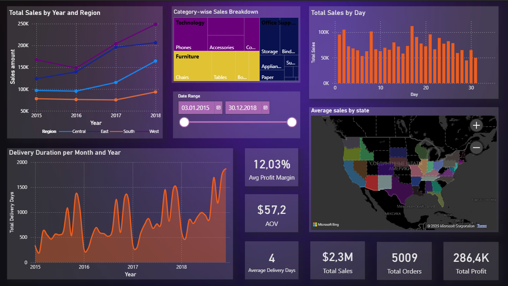

Opis danych i projektu

Dane pochodzą z zestawu informacji o sprzedaży sklepu Superstore w Stanach Zjednoczonych w latach 2015-2018. Zawierają dane dotyczące zamówień, klientów, produktów, regionów, terminów dostawy, kategorii towarów oraz wskaźników finansowych.

Źródło danych: [Superstore Dataset na Kaggle](https://www.kaggle.com/datasets/vivek468/superstore-dataset-final)

W ramach projektu przeprowadzono kompleksową analizę danych, obejmującą przygotowanie i czyszczenie danych za pomocą SQL i Power BI, budowę modelu danych w Power Query oraz tworzenie raportów i dashboardów do wizualizacji kluczowych wskaźników biznesowych.

Opis plików projektu
0-README.md

Plik zawierający ogólny opis projektu, danych i celów pracy. Zawiera wprowadzenie oraz instrukcję dotyczącą struktury projektu.

01-sql+powerbi.md

Dokument opisujący etapy przygotowania danych: tworzenie zapytań SQL do selekcji i wstępnego przetwarzania danych oraz integracja danych w Power BI do dalszej analizy.

02-powerquery-model-description.md

Plik ze szczegółowym opisem modelu danych zbudowanego w Power Query. Omawia transformacje, czyszczenie danych, tworzenie kolumn obliczeniowych oraz miar, które przygotowano do wizualizacji.

03-f-dhboard.md

Dokument opisujący prace nad stworzeniem dashboardu: strukturę wizualizacji, użyte typy wykresów i wskaźników, opis kluczowych elementów oraz ich przeznaczenie i wnioski wynikające z analizy danych.
