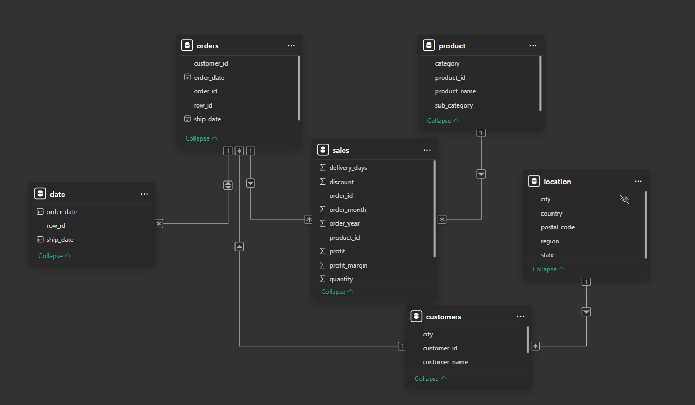

Model danych został znormalizowany poprzez rozdzielenie danych na fakt i wymiary (dimension tables). Główna tabela faktów to tabela sales, która zawiera informacje o transakcjach, takie jak liczba zamówionych produktów (quantity), zysk (profit), rabaty (discount) oraz szczegóły dotyczące zamówienia (order_id, product_id).

Tabela faktów jest połączona z kilkoma tabelami wymiarów, które zawierają szczegółowe informacje opisujące różne aspekty danych.

