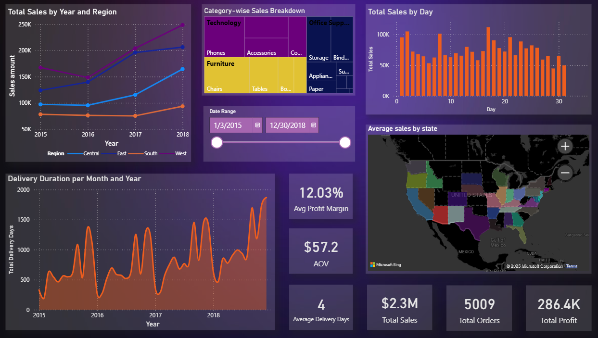

Total Sales by Year and Region

Pokazuje całkowitą wartość sprzedaży w podziale na lata (2015-2018). Kolorowe linie odpowiadają różnym regionom USA: Central, East, South, West. Umożliwia zobaczenie trendów sprzedaży w poszczególnych regionach.

Category-wise Sales Breakdown

Rozkład sprzedaży na kategorie produktów: Technology, Furniture, Office Supplies. Rozmiar prostokątów odzwierciedla udział sprzedaży każdej kategorii i podkategorii. Pomaga zrozumieć, które kategorie przynoszą największe przychody.

Total Sales by Day

Przedstawia sprzedaż w podziale na dni miesiąca. Pomaga zidentyfikować dni z najwyższą i najniższą sprzedażą oraz analizować sezonowość.

Date Range

Pozwala wybrać zakres dat do analizy (od 1 marca 2015 do 30 grudnia 2018). Steruje przedziałem czasowym uwzględnianym na wszystkich wykresach.

Delivery Duration per Month and Year

Pokazuje sumaryczny czas dostawy (w dniach) w podziale na miesiące i lata. Pozwala śledzić zmiany w logistyce i czasie realizacji dostaw.

Avg Profit Margin

Średnia marża zysku (12,03%). Pokazuje, jaka część sprzedaży to czysty zysk.

AOV

Średnia wartość jednego zamówienia (57,2 USD). Pomaga ocenić średnią wartość koszyka klienta.

Average Delivery Days

Średnia liczba dni potrzebnych na dostawę zamówienia (4 dni). Ważny wskaźnik jakości obsługi i satysfakcji klienta.

Average sales by state

Geograficzny rozkład średniej sprzedaży według stanów USA. Kolory pokazują różnice w poziomie sprzedaży między stanami.

Total Sales

Całkowita wartość sprzedaży za cały okres — 2,3 mln USD.

Total Orders

Łączna liczba zrealizowanych zamówień — 5009.

Total Profit

Łączny zysk netto za cały okres — 286,4 tys. USD.
