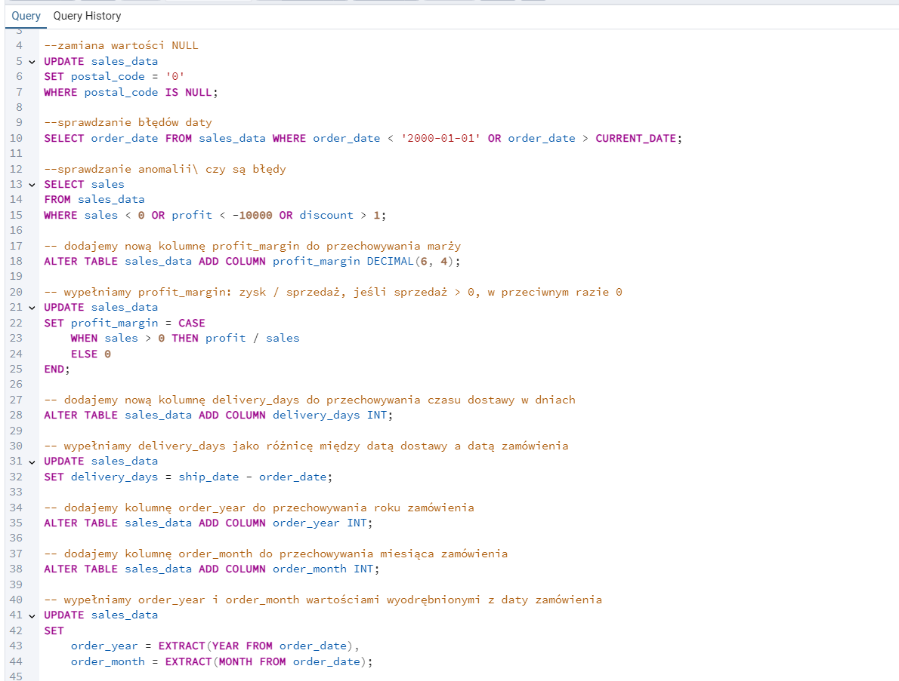

Najpierw utworzyłam tabelę w bazie danych o odpowiedniej strukturze, 
dopasowanej do danych z pliku CSV. Tabela zawiera wszystkie niezbędne kolumny z odpowiednimi typami danych.

Po utworzeniu tabeli został wykonany import danych z pliku CSV

Przygotowanie danych przed budową modelu i wizualizacją

